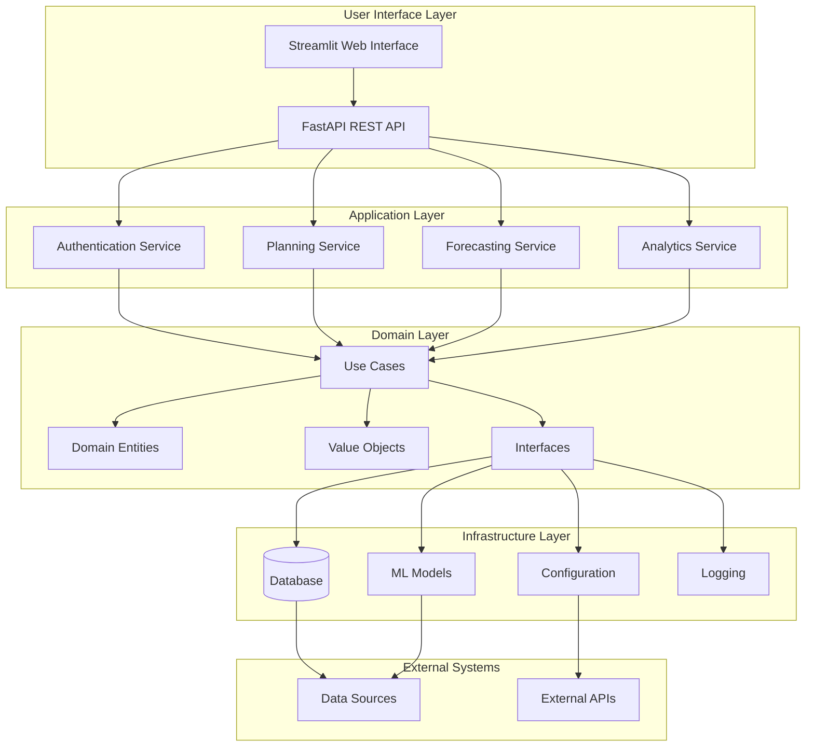

# Beverly Knits AI Supply Chain Planner - System Architecture Overview

## 🏗️ High-Level Architecture



## 📊 Component Breakdown

### 1. User Interface Layer

#### Streamlit Web Interface (`main.py`)
- **Purpose**: Primary user interface for supply chain planning
- **Features**:
  - Interactive dashboards and visualizations
  - Real-time data processing and analysis
  - Planning execution and monitoring
  - Report generation and export
- **Technology**: Streamlit with Plotly for visualizations
- **Key Components**:
  - Data upload and validation
  - Planning configuration
  - Results visualization
  - Export functionality

#### FastAPI REST API (`api/main.py`)
- **Purpose**: RESTful API for programmatic access
- **Features**:
  - OpenAPI/Swagger documentation
  - JWT authentication
  - Comprehensive validation
  - Rate limiting and security
- **Endpoints**:
  - Authentication: `/api/v1/auth/*`
  - Materials: `/api/v1/materials/*`
  - Suppliers: `/api/v1/suppliers/*`
  - Planning: `/api/v1/planning/*`
  - Forecasting: `/api/v1/forecasting/*`
  - Analytics: `/api/v1/analytics/*`

### 2. Application Layer

#### Authentication Service (`src/auth/`)
- **Components**:
  - JWT token management
  - Role-based access control
  - Session management
  - Password security (bcrypt)
- **Features**:
  - User registration and login
  - Permission management
  - Security middleware
  - Account lockout protection

#### Planning Service (`src/core/use_cases/`)
- **Core Planning Engine**: 6-phase planning process
  1. **Forecast Unification**: Multi-source demand aggregation
  2. **BOM Explosion**: SKU-to-material requirement conversion
  3. **Inventory Netting**: Current stock and PO accounting
  4. **Procurement Optimization**: EOQ and safety stock calculations
  5. **Supplier Selection**: Multi-criteria optimization
  6. **Output Generation**: Actionable recommendations

#### Forecasting Service (`src/engine/forecasting/`)
- **ML Models**:
  - ARIMA: Time series forecasting
  - Prophet: Trend and seasonality analysis
  - LSTM: Deep learning predictions
  - XGBoost: Gradient boosting optimization
- **Features**:
  - Multi-model ensemble predictions
  - Confidence intervals
  - Model selection and validation
  - Performance monitoring

#### Analytics Service (`src/core/use_cases/`)
- **Reporting Engine**: Comprehensive analytics
- **Key Reports**:
  - Supply chain performance metrics
  - Cost analysis and optimization
  - Supplier performance tracking
  - Inventory turnover analysis
  - Risk assessment reports

### 3. Domain Layer (`src/core/domain/`)

#### Domain Entities (`entities.py`)
```python
# Core business entities
class Material:
    - id: MaterialId
    - name: str
    - type: MaterialType
    - specifications: Dict
    - is_critical: bool

class Supplier:
    - id: SupplierId
    - name: str
    - contact_info: str
    - reliability_score: float
    - risk_level: RiskLevel

class BOM:
    - sku_id: str
    - material_id: MaterialId
    - quantity_per_unit: Quantity
    - waste_percentage: float

class Forecast:
    - sku_id: str
    - forecast_date: date
    - forecast_quantity: Quantity
    - confidence_score: float
    - source: ForecastSource

class ProcurementRecommendation:
    - material_id: MaterialId
    - supplier_id: SupplierId
    - recommended_quantity: Quantity
    - estimated_cost: Money
    - urgency_level: UrgencyLevel
```

#### Value Objects (`value_objects.py`)
```python
# Immutable value objects
class Money:
    - amount: Decimal
    - currency: str

class Quantity:
    - amount: Decimal
    - unit: str

class MaterialId:
    - value: str

class SupplierId:
    - value: str
```

#### Use Cases (`use_cases/`)
- **SupplyChainPlanningService**: Core planning orchestration
- **DataQualityService**: Data validation and cleaning
- **ReportingService**: Analytics and reporting
- **MaterialManagementService**: Material catalog management
- **SupplierManagementService**: Supplier relationship management

### 4. Infrastructure Layer

#### Database Layer (`src/database/`)
- **SQLAlchemy Models**: ORM mappings for all entities
- **Repository Pattern**: Clean data access abstraction
- **Migration Support**: Alembic for schema evolution
- **Connection Management**: Pooled database connections

#### ML Model Infrastructure (`src/engine/`)
- **Model Manager**: ML model lifecycle management
- **Production ML Loader**: Production-ready model serving
- **Model Training**: Automated retraining pipeline
- **Performance Monitoring**: Model performance tracking

#### Configuration Management (`src/config/`)
- **Environment-specific**: Development, staging, production
- **Settings Management**: Pydantic-based configuration
- **Environment Loader**: Automated environment detection
- **Validation**: Configuration validation and defaults

#### Logging and Monitoring (`src/utils/`)
- **Structured Logging**: JSON-formatted logs
- **Error Tracking**: Comprehensive error monitoring
- **Performance Metrics**: Response time and throughput
- **Audit Trail**: Complete operation logging

### 5. Data Processing Pipeline

#### Data Integration (`src/data/`)
- **Live Data Integrator**: Real Beverly Knits data processing
- **Data Quality Fixer**: Automated data cleaning
- **Validation Pipeline**: Schema and business rule validation
- **Backup Management**: Automated data backup and recovery

#### Data Sources
- **CSV Files**: Excel/CSV data imports
- **Database**: PostgreSQL/SQLite storage
- **API Integration**: External system integration
- **Manual Entry**: User-entered data validation

## 🔧 Technology Stack

### Backend Technologies
- **Python 3.8+**: Core programming language
- **FastAPI**: Modern web framework for APIs
- **SQLAlchemy**: Database ORM and migrations
- **Pydantic**: Data validation and settings
- **Alembic**: Database migration tool

### ML/AI Technologies
- **TensorFlow**: Deep learning framework
- **PyTorch**: Alternative deep learning framework
- **Prophet**: Facebook's forecasting library
- **XGBoost**: Gradient boosting framework
- **scikit-learn**: Machine learning utilities
- **Statsmodels**: Statistical modeling

### Frontend Technologies
- **Streamlit**: Web interface framework
- **Plotly**: Interactive visualizations
- **Pandas**: Data manipulation
- **NumPy**: Numerical computing

### Infrastructure Technologies
- **PostgreSQL**: Production database
- **SQLite**: Development database
- **Uvicorn**: ASGI web server
- **pytest**: Testing framework
- **Docker**: Containerization (future)

## 🚀 Deployment Architecture

### Development Environment
```
Developer Machine
├── Python Virtual Environment
├── SQLite Database
├── Local File Storage
├── Development Configuration
└── Debug Logging
```

### Production Environment
```
Production Server
├── Uvicorn Web Server
├── PostgreSQL Database
├── Redis Cache (planned)
├── Production Configuration
├── Centralized Logging
└── Monitoring & Alerting
```

### Scalability Considerations
- **Horizontal Scaling**: API can be scaled across multiple instances
- **Database Scaling**: Read replicas and connection pooling
- **ML Model Serving**: Separate model serving infrastructure
- **Caching Layer**: Redis for performance optimization
- **Load Balancing**: Nginx for traffic distribution

## 🔐 Security Architecture

### Authentication Flow
```
User Request → JWT Token → Role Validation → Permission Check → API Access
```

### Security Layers
1. **Network Security**: HTTPS/TLS encryption
2. **Application Security**: Input validation and sanitization
3. **Authentication**: JWT token-based authentication
4. **Authorization**: Role-based access control
5. **Data Security**: Database encryption and backups

### Security Features
- **JWT Tokens**: Secure token-based authentication
- **Password Hashing**: Bcrypt with salt
- **Rate Limiting**: API rate limiting middleware
- **Input Validation**: Comprehensive request validation
- **Security Headers**: CSRF, XSS protection
- **Audit Logging**: Complete security audit trail

## 📊 Data Flow Architecture

### Planning Process Flow
```
Data Input → Quality Validation → Domain Processing → ML Analysis → Recommendations → Output
```

### Detailed Data Flow
1. **Data Ingestion**: CSV/API data import
2. **Data Validation**: Schema and business rule validation
3. **Data Processing**: Domain entity creation
4. **ML Processing**: Forecasting and optimization
5. **Business Logic**: Planning engine execution
6. **Output Generation**: Recommendations and reports
7. **Data Storage**: Persistent storage and backup

## 🎯 Performance Characteristics

### Response Times
- **API Endpoints**: < 200ms for simple queries
- **Planning Execution**: 5-30 seconds depending on data size
- **ML Forecasting**: 1-5 seconds per model
- **Report Generation**: 2-10 seconds

### Scalability Metrics
- **Concurrent Users**: 100+ supported
- **Data Volume**: 10,000+ materials/suppliers
- **Planning Frequency**: Real-time to daily planning cycles
- **Model Training**: Weekly to monthly retraining

## 🔄 Integration Points

### External Systems
- **ERP Systems**: SAP, Oracle integration capability
- **Supplier APIs**: Direct supplier data integration
- **E-commerce**: Shopify, WooCommerce integration
- **Analytics**: Business intelligence tool integration

### Data Formats
- **Input**: CSV, JSON, Excel, API
- **Output**: CSV, JSON, PDF, Excel
- **Interchange**: RESTful API, webhooks
- **Backup**: Automated database backups

## 📈 Monitoring and Observability

### Key Metrics
- **Business Metrics**: Planning accuracy, cost savings
- **Technical Metrics**: Response times, error rates
- **ML Metrics**: Model accuracy, prediction confidence
- **Infrastructure Metrics**: CPU, memory, database performance

### Monitoring Tools
- **Application Monitoring**: Custom logging and metrics
- **Database Monitoring**: Query performance and connections
- **ML Model Monitoring**: Prediction accuracy and drift
- **Infrastructure Monitoring**: System resources and health

This architecture provides a robust, scalable foundation for the Beverly Knits AI Supply Chain Planner while maintaining flexibility for future enhancements and integrations.