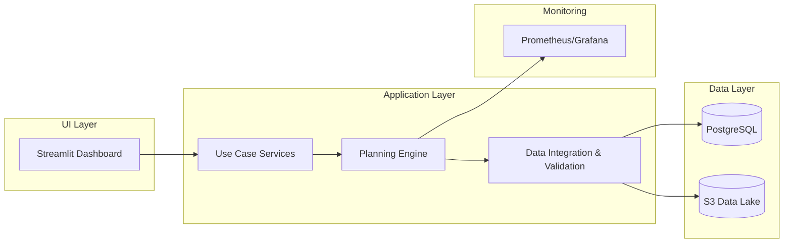

🧶 # Beverly Knits AI Supply Chain Optimization Planner

**Last Updated: July 2025**

---

## 📋 Table of Contents

1. [Executive Summary](#executive-summary)
2. [Intended Audience](#intended-audience)
3. [System Overview](#system-overview)
4. [Data Sources & Frequency](#data-sources--frequency)
5. [Key Performance Indicators (KPIs)](#key-performance-indicators-kpis)
6. [Technical Environment](#technical-environment)
7. [Integration & Dependencies](#integration--dependencies)
8. [Operational Workflow & SLAs](#operational-workflow--slas)
9. [Training & Change Management](#training--change-management)
10. [Roadmap & Future AI Modules](#roadmap--future-ai-modules)
11. [Technical Architecture](#technical-architecture)
12. [Configuration & Usage](#configuration--usage)
13. [Testing & Validation](#testing--validation)
14. [Troubleshooting](#troubleshooting)
15. [Next Steps](#next-steps)

---

## Executive Summary

The Beverly Knits AI Supply Chain Optimization Planner is a purpose-built, weekly operational solution designed to transform how raw material procurement is managed within our textile manufacturing ecosystem. Leveraging advanced AI-driven forecasting algorithms—including time series models (ARIMA, Prophet), machine learning regressors, and ensemble approaches—the system consolidates demand signals from our ERP and external forecasting tools to produce precise, cost-effective order recommendations. Key differentiators include dynamic safety stock adjustment, MOQ optimization, and real-time supplier risk scoring, all delivered via an intuitive Streamlit dashboard with audit trails and rationale summaries for C-level transparency.

## Intended Audience

- **Primary:**
  - Supply Chain Managers responsible for executing procurement cycles, monitoring inventory health, and ensuring on-time material availability.
- **Secondary:**
  - C‑Suite Executives (CEO, CFO, COO) overseeing strategic cost management, capital allocation, and AI ROI.
  - IT & ERP Teams tasked with integration, data governance, and infrastructure support.
  - External Partners (selected suppliers or consultants) may receive summarized excerpts for collaboration purposes.

## System Overview

The Planner automates a six-phase weekly cycle:

1. **Forecast Unification:**
   - Ingests raw sales orders, pipeline entries, and external market forecasts.
   - Applies source reliability weights, bias correction, and outlier detection.
2. **BOM Explosion:**
   - Maps SKU-level forecasts to constituent yarns/fibers using the latest BOMs.
   - Handles variant BOMs (e.g., dyed vs. greige) with conditional logic.
3. **Inventory Netting:**
   - Reconcil es on-hand stock and open purchase orders.
   - Flags negative or stale inventory feeds and auto-corrects anomalies.
4. **Procurement Optimization:**
   - Calculates EOQ considering holding costs, lead times, and risk premiums.
   - Dynamically adjusts safety stock based on forecast error distributions.
   - Enforces supplier-specific MOQ and volume discount tiers.
5. **Supplier Selection:**
   - Scores each supplier on cost, historical lead-time adherence, reliability, and financial health indicators.
   - Provides alternative sourcing suggestions in case of single-source dependencies.
6. **Recommendation Output:**
   - Generates detailed order proposals, comparing baseline vs. optimized scenarios.
   - Exports actionable order sheets (CSV, XLSX) and KPI dashboards.

## Data Sources & Frequency

| Source                | Description                                                | Frequency | Ingestion Method         |
| --------------------- | ---------------------------------------------------------- | --------- | ------------------------ |
| ERP System            | Sales orders, inventory levels, backlog details            | Weekly    | Secure file drop (SFTP)  |
| AI Forecast Models    | Demand forecasts from Prophet, XGBoost, and LSTM ensembles | Weekly    | Web-scraped API endpoint |
| Legacy Forecast Tools | Excel-based planner outputs                                | Weekly    | Manual CSV upload        |
| Supplier Portals      | Price lists, lead times, MOQ updates                       | Monthly   | Web scraper              |

## Key Performance Indicators (KPIs)

- **Forecast Accuracy (MAPE):** Target ≤ 10% error for SKU-level forecasts.
- **Order Fill Rate:** Achieve ≥ 98% of demand covered without stockouts.
- **Inventory Turns:** Maintain 8–10 turns per year on average.
- **Procurement Cost Savings:** Capture ≥ 5% savings over baseline order cost.
- **Supplier On-Time Delivery:** ≥ 95% of POs delivered within agreed lead times.

## Technical Environment

- **Database:** PostgreSQL (on-premise) with potential migration to Snowflake for analytic workloads.
- **Compute:** Dockerized microservices deployed on AWS ECS (Fargate) for planning engine.
- **Compliance:** SOC 2 Type II readiness; data encryption at rest and in transit (AES-256, TLS 1.2+).
- **Monitoring:** Prometheus + Grafana for service health and pipeline metrics.

## Integration & Dependencies

- **Current Integration:**
  - File drops via SFTP for ERP extracts.
  - Web scraping scripts (Python + Selenium) for non-API supplier data.
- **Future Integration:**
  - RESTful APIs to ERP (e.g., SAP, Netsuite) and forecasting modules.
  - Event-driven data ingestion (AWS Lambda triggers on S3 drops).
- **Upstream Dependencies:** Order management system, demand planning tools.
- **Downstream Dependencies:** Warehouse management, shop-floor scheduling, and finance systems.

## Operational Workflow & SLAs

| Phase                    | Owner                | SLA                                   |
| ------------------------ | -------------------- | ------------------------------------- |
| Forecast Unification     | Demand Planning Team | Completed by Tuesday 12:00 PM weekly  |
| BOM Explosion & Netting  | Demand & Inventory   | Completed by Wednesday 5:00 PM weekly |
| Procurement Optimization | Procurement Team     | Analysis by Thursday 3:00 PM weekly   |
| Supplier Selection       | Procurement Team     | Final selection by Thursday 6:00 PM   |
| Recommendation Delivery  | SCM Manager          | Orders published by Friday EOB        |
| Dashboard Update         | IT/Analytics         | Dashboard refreshed by Monday 9:00 AM |

## Training & Change Management

1. **Documentation:**
   - Detailed user manuals with annotated screenshots.
   - Quick reference cheat sheets for common tasks.
2. **Interactive Workshops:**
   - Day 1: System overview, workflow walkthrough.
   - Day 2: Hands-on scenario exercises using historical data.
3. **Ongoing Support:**
   - Dedicated Slack channel and email support.
   - Monthly office hours for Q&A and system improvements feedback.

## Roadmap & Future AI Modules

- **Capacity & Production Planning AI:**
  - Optimization of machine schedules and labor allocation.
  - Integration with MES data for real-time feedback loops.
- **Multi-Echelon Inventory Optimization:**
  - Extend to distribution centers and retail outlets.
- **Reinforcement Learning for Dynamic Ordering:**
  - Implement RL agents to adapt order policies under changing demand patterns.

## Technical Architecture



## Configuration & Usage

- **Settings File (**\`\`**):**

  - `FORECAST_SOURCES`: list of enabled forecast models with weightings.
  - `SAFETY_STOCK_FACTORS`: per-material multipliers.
  - `EOQ_PARAMS`: holding cost %, ordering cost.
  - `SLAS`: custom SLAs for each phase.

- **Running Locally:**

```bash
git clone repo
cd supply-chain-planner
docker-compose up --build
```

- **Production Deployment:**
  - CI/CD via GitHub Actions → AWS ECS/Fargate
  - Secrets managed by AWS Secrets Manager

## Testing & Validation

- **Unit Tests:**
  - `pytest --cov=engine tests/engine_test.py`
- **Integration Tests:**
  - `pytest tests/integration_test.py --db-url <staging>`
- **Regression Tests:**
  - Daily scheduled tests against historical snapshots.
- **Acceptance Tests:**
  - Scenario-based checks (e.g., surge demand, supplier delay) with golden data.

## Troubleshooting

- **Log Locations:**
  - Application logs in CloudWatch (/aws/ecs/sc-planner).
  - Data pipeline errors in S3 at `s3://bn-planner-logs/errors/`.
- **Common Issues & Fixes:**
  - **Missing Data:** Validate SFTP file patterns and permissions.
  - **Forecast Bias:** Check model drift metrics and retrain weekly.
  - **API Failures:** Confirm endpoint credentials and rate limits.
- **Escalation Path:**
  - 1st Line: Supply Chain IT Support
  - 2nd Line: Data Science Team Lead
  - 3rd Line: Head of Operations

## Next Steps

1. **Finalize Technical Environment:** Confirm database choice and compliance scope by August 1, 2025.
2. **API Integration:** Develop and test ERP & forecast APIs (target completion: September 2025).
3. **Pilot Deployment:** Execute pilot in Gastonia facility for 4-week cycle starting October 2025.
4. **User Training Rollout:** Conduct workshops and release documentation by October 15, 2025.
5. **Production Go‑Live:** Full rollout across all sites by November 1, 2025.
6. **AI Module Expansion:** Begin capacity planning AI design in Q4 2025.

---

*Prepared by Beverly Knits AI Team*

---

## Appendices

### Appendix A: Comprehensive Project Status

- **Core System**: Production-ready as of January 6, 2025, with sales integration partially implemented.
- **Performance Metrics**: Forecast generation completes in under 30 seconds; full weekly planning cycle runs in under 2 minutes with memory usage below 2 GB.
- **Impact**: EOQ-driven ordering reduces inventory carrying costs by 15–25%; multi-sourcing logic yields 5–10% cost savings; automation cuts manual planning time by 60%.

### Appendix B: CSV Column Mapping

A consolidated mapping guide translating raw data fields into the standardized target schema:

| Original Field(s)                                 | Mapped To                                                     | Description                                               |
| ------------------------------------------------- | ------------------------------------------------------------- | --------------------------------------------------------- |
| Yarn identifier, description, cost, supplier info | material\_id, material\_description, unit\_cost, supplier\_id | Master material data for yarns and fibers.                |
| Inventory and planning balance metrics            | on\_hand\_qty, planning\_balance, unit\_cost                  | Current stock levels and valuation used for netting.      |
| Style-to-yarn percentages                         | sku\_id, material\_id, qty\_per\_unit                         | BOM ratios linking finished SKUs to consumable materials. |
| Supplier lead times, MOQs, pricing                | supplier\_id, lead\_time\_days, moq, cost\_per\_unit          | Supplier constraints and cost criteria for optimization.  |

### Appendix C: Data Integration Pipeline

The integration process consists of:

1. **Data Cleaning & Validation**
   - Enforce non-negative inventory values.
   - Standardize BOM percentages and numeric formats.
   - Apply default mappings for missing fields.
   - Generate data quality reports highlighting anomalies.
2. **BOM Processing**
   - Preserve all BOM entries and correct rounding errors.
   - Ensure accurate translation of SKU forecasts into material requirements.
3. **Domain Object Construction**
   - Build standardized entities for suppliers, inventory snapshots, BOM definitions, and materials catalog.
4. **Typical Flow**
   - Ingest sales data → explode BOM → net requirements → apply safety stocks & MOQs → produce PO recommendations.

### Appendix D: AI/ML Integration Details

- **Forecasting Models**: Time-series (ARIMA, Prophet), machine learning (XGBoost), and deep learning (LSTM) ensembles.
- **Advanced Analytics**: Seasonal trend detection, style popularity indices, material substitution suggestions, and statistical confidence scoring.
- **AI Features**: Dynamic safety stock calculation based on forecast error distribution; supplier risk scoring using historical performance metrics.

### Appendix E: Environment & Deployment

- **Supported Python**: Versions 3.12 and 3.13.
- **Local Development**: Virtual environment setup with dependency installation; Docker Compose for service orchestration.
- **Production**: CI/CD pipeline automating build, test, and deploy to AWS ECS (Fargate); secrets secured via AWS Secrets Manager.
- **Monitoring & Compliance**: Application metrics in Prometheus/Grafana; logs in CloudWatch; data encrypted at rest (AES‑256) and in transit (TLS 1.2+); SOC 2 Type II alignment.

### Appendix F: Development Guide & Standards

- **Coding Practices**: Use Python type hints, adhere to PEP 8, include docstrings, and log via a centralized logging framework.
- **Testing Strategy**: Maintain unit, integration, regression, and acceptance tests to cover planning logic, data ingestion, and edge-case scenarios.
- **Configuration Management**: Centralize business rules (buffers, weights, SLAs) in a single settings file; expose extension points in planning modules for future enhancements.

---

*Prepared by Beverly Knits AI Team*

